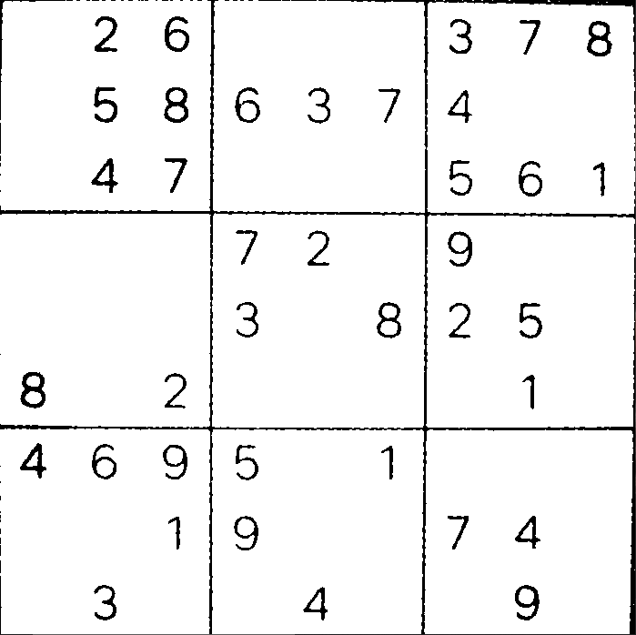
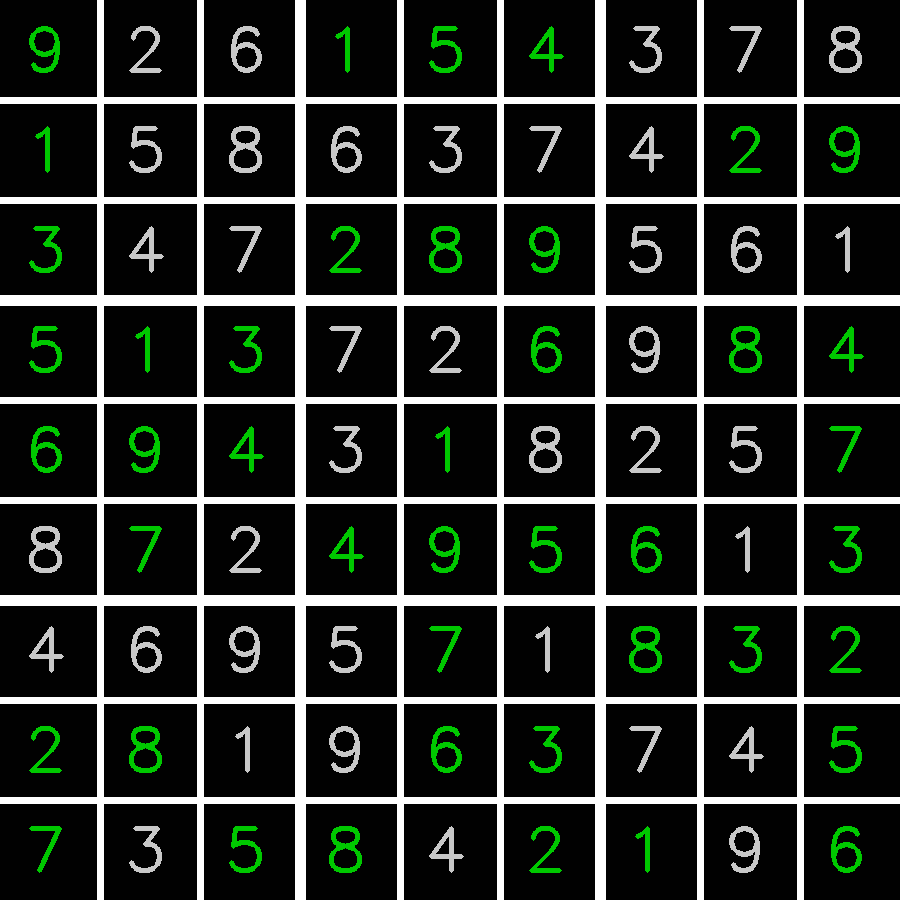

# Sudoku Solver with Computer Vision

Solve Sudoku puzzles in real-time using computer vision, deep learning, and Python. This project captures a Sudoku grid using a webcam, processes it to recognize digits, solves the puzzle, and outputs the solution as a PNG file.

# Features

Real-Time Detection: Capture Sudoku grids directly from a webcam.

Digit Recognition: Uses a Convolutional Neural Network (CNN) for accurate digit classification.

Puzzle Solving: Implements a backtracking algorithm to solve the Sudoku puzzle efficiently.

Output: Generates a PNG file with the solved Sudoku overlaid on the original grid.

# Tech Stack

Programming Language: Python

Libraries: OpenCV, NumPy, TensorFlow/Keras (for CNN), Matplotlib

Algorithm: Backtracking for puzzle solving

# Example Output

  
  

# Future Enhancements

Improve digit recognition accuracy with larger datasets.

Add support for handwritten Sudoku grids.

Deploy as a web or mobile application for wider accessibility.
